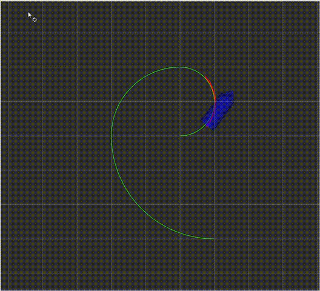

#  Car Simulation with MPC Controller 

This code implements a car simulator. And implements MPC(Model Predictive Control) algorithm to control the simulated car to fllow a trajectory.

<p align="center">
    
</p>

## DEPENDENCIES

This software is built on the Robotic Operating System (ROS), which needs to be installed first.

* ROS : Noetic or Melodic
  * How to install ROS : [Neotic](http://wiki.ros.org/noetic/Installation/Ubuntu) , [Melodic](https://wiki.ros.org/melodic)

## HOW TO RUN

```
1. ./install_tools.sh
2. catkin_make -j1
3. source devel/setup.bash
4. roslaunch mpc_car simulation.launch
```

## HOW TO TURN PARAMETERS

```
./src/mpc_car/config/mpc_car.yaml -> mpc parameters
./src/car_simulator/config/car_simulator.yaml -> initial states (in simulation)
```
## RUBRIC POINTS
### Loops, Functions, I/O
1.CRITERIA-The project demonstrates an understanding of C++ functions and control structures.
```
In "./src/mpc_car/src/mpc_car_nodelet.cpp",line 21, i use "if" control structure.
In "./src/mpc_car/include/mpc_car/mpc_car.hpp",line 415, i use "for" control structure.
```
2.CRITERIA-The project reads data from a file and process the data, or the program writes data to a file.
```
 In "./src/mpc_car/launch/simulation.launch" line 11. The <rosparam> tag enables the use of rosparam YAML files for loading and dumping parameters from the ROS Parameter Server. It can also be used to remove parameters. The <rosparam> tag can be put inside of a <node> tag, in which case the parameter is treated like a private name. 
```
3.CRITERIA-The project accepts user input and processes the input..
```
not meet. 
```
### Object Oriented Programming
4.CRITERIA-The project uses Object Oriented Programming techniques.
```
In "./src/mpc_car/include/mpc_car/mpc_car.hpp" line 20 . I definate a class called mpc_car with class attributes to hold the data, and class methods to perform tasks.
```
5.CRITERIA-Classes use appropriate access specifiers for class members.
```
In "./src/mpc_car/include/mpc_car/mpc_car.hpp" line 21 . I definate private members.
In "./src/mpc_car/include/mpc_car/mpc_car.hpp" line 152 . I definate public members.
```
6.CRITERIA-Class constructors utilize member initialization lists.
```
In "./src/mpc_car/include/mpc_car/mpc_car.hpp" line 153 . I use class constructor utilize member initialization lists.
```
7.CRITERIA-Classes encapsulate behavior..
```
meet the rubric, In "./src/mpc_car/include/mpc_car/mpc_car.hpp" line 20 . the difination of class MpcCar.
```
8.CRITERIA-Classes follow an appropriate inheritance hierarchy.
```
meet the rubric, In "./src/car_simulator/src/car_simulator_nodelet.cpp", line 42 ,i inheritance from class Nodelet
```
9.CRITERIA-Overloaded functions allow the same function to operate on different parameters.
```
not meet
```
10.CRITERIA-Derived class functions override virtual base class functions.
```
not meet
```
11.CRITERIA-Templates generalize functions in the project.
```
not meet
```
12.CRITERIA-Templates generalize functions in the project.
```
not meet
```
### Memory Management
13.CRITERIA-The project makes use of references in function declarations..
```
In "./src/mpc_car/include/mpc_car/mpc_car.hpp" line 128 . i use reference as input.
```
14.CRITERIA-The project uses destructors appropriately.
```
not meet.
```
15.CRITERIA-The project uses scope / Resource Acquisition Is Initialization (RAII) where appropriate..
```
not meet.
```
16.CRITERIA-The project follows the Rule of 5.
```
not meet.
```
17.CRITERIA-The project uses move semantics to move data, instead of copying it, where possible..
```
not meet.
```
18.CRITERIA-The project uses smart pointers instead of raw pointers..
```
In "./src/mpc_car_nodelet.cpp",line 12 , i use std::shared_ptr.
```
### Memory Management
```
 not meet 
```
