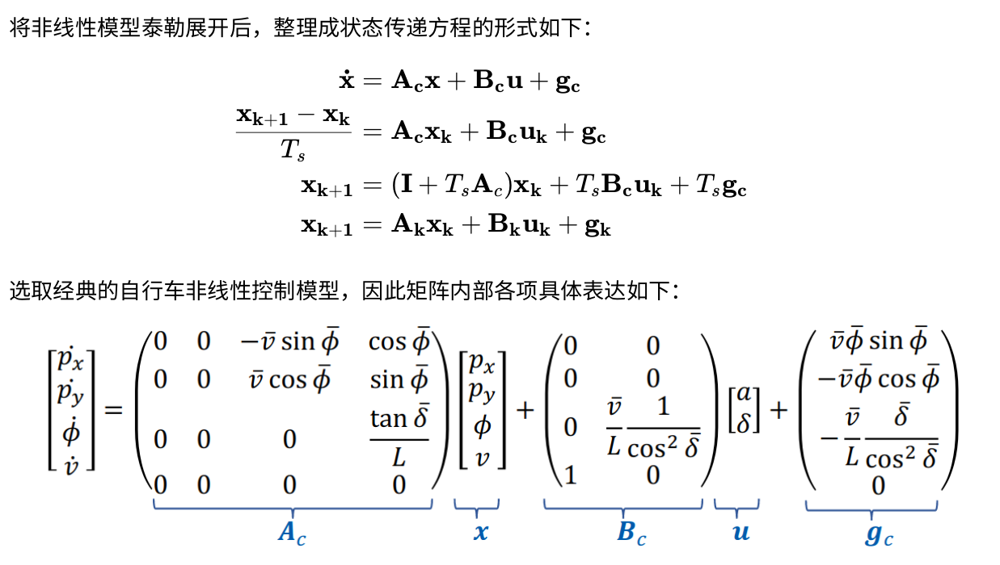
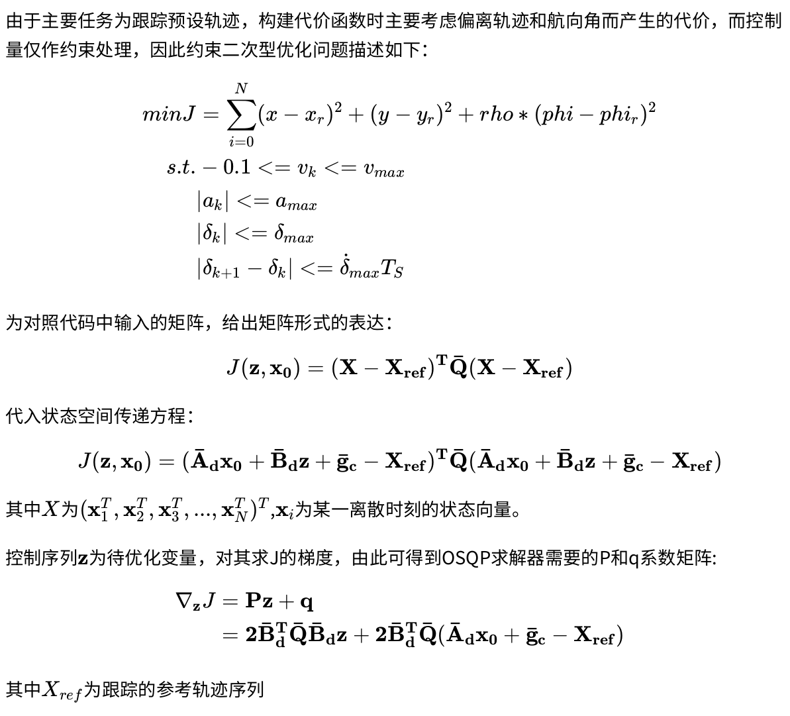

#  Car Simulation with MPC Controller 

This code implements a car simulator. And implements MPC(Model Predictive Control) algorithm to control the simulated car to fllow a trajectory.

<p align="center">
    
</p>

## Dependencies

This software is built on the Robotic Operating System (ROS), which needs to be installed first. Additionally, the car simulation depends on following software:

* ROS :noetic or melodic
  * how to install ROS :[neotic](https://ros.org),[melodic](https://ros.org)
  
* cmake >= 3.11
  * All OSes: [click here for installation instructions](https://cmake.org/install/)

## HOW TO RUN

```
./install_tools.sh
catkin_make -j1
source devel/setup.bash
roslaunch mpc_car simulation.launch
```

## HOW TO TURN PARAMETERS

```
./src/mpc_car/config/mpc_car.yaml -> mpc parameters
./src/car_simulator/config/car_simulator.yaml -> initial states (in simulation)
```

## Theory

### Linearize  Nonlinear Model

<p align="center">
  
</p>

### Constrained Quadratic Problem
 
<p align="center">
   
</p>

### Delay Compensation

<p align="center">
  
 </p>

# CppND-CapstoneProject-CarSimulatorr
